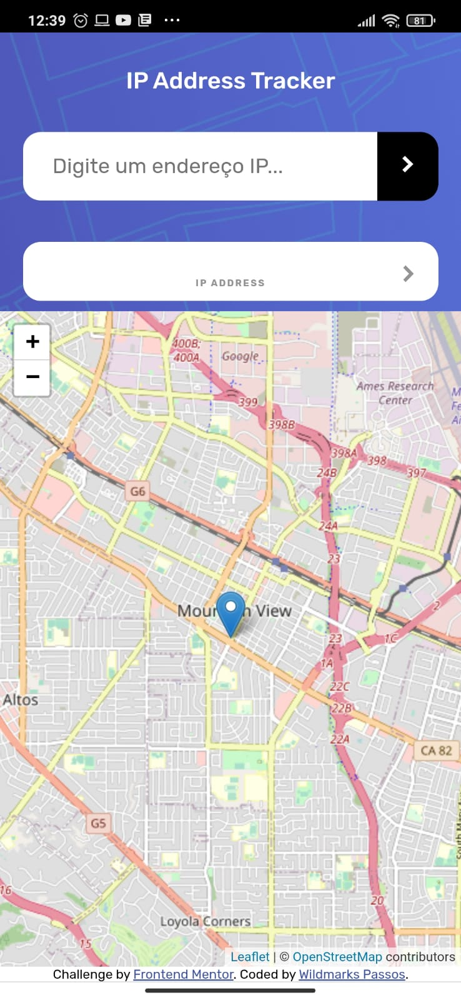
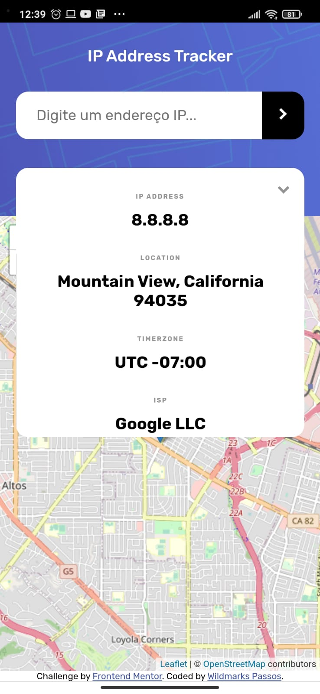
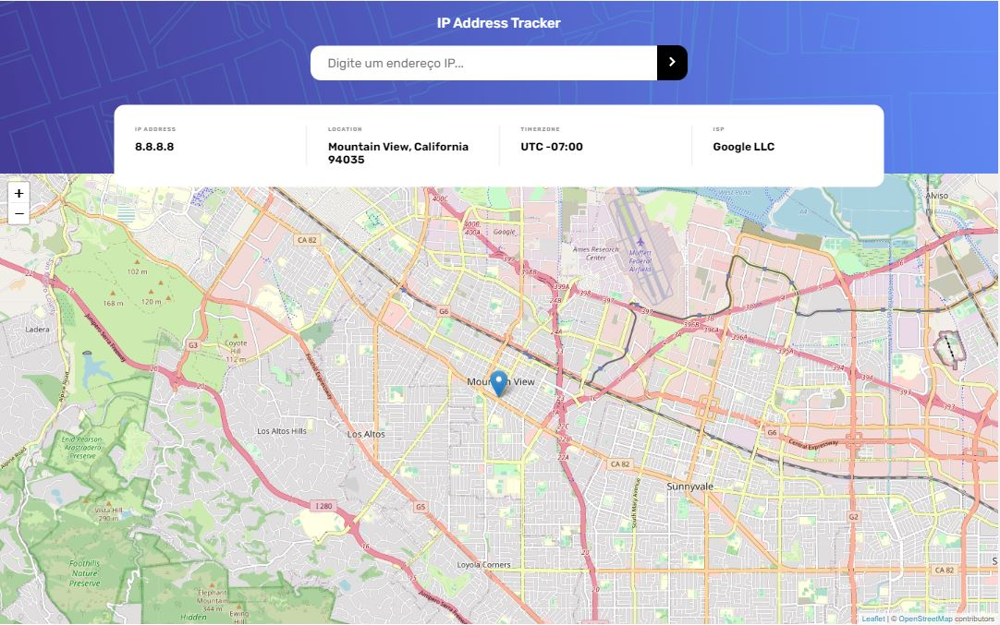

# Frontend Mentor - IP address tracker solution

This is a solution to the [IP address tracker challenge on Frontend Mentor](https://www.frontendmentor.io/challenges/ip-address-tracker-I8-0yYAH0). Frontend Mentor challenges help you improve your coding skills by building realistic projects.  

## Table of contents

- [Overview](#overview)
  - [The challenge](#the-challenge)
  - [Screenshot](#screenshot)
  - [Links](#links)
- [My process](#my-process)
  - [Built with](#built-with)
  - [Continued development](#continued-development)
- [Author](#author)

## Overview

### The challenge

Users should be able to:

- View the optimal layout for each page depending on their device's screen size
- See hover states for all interactive elements on the page
- See their own IP address on the map on the initial page load
- Search for any IP addresses or domains and see the key information and location

### Screenshot

### Links

- Live Site URL: [Live site URL here](https://wildmarks-passos.github.io/ip-address-tracker-master/)

## My process

### Built with

- Semantic HTML5 markup
- CSS custom properties
- Flexbox
- Mobile-first workflow
- [React](https://reactjs.org/) - JS library
- [Styled-Components](https://styled-components.com/) - JS library that uses the concept of CSS-in-JS
- [React-Leaflet](https://react-leaflet.js.org/) - JS library for rendering maps
- [Ipify](https://geo-database.ipify.org/) - An IP geolocation database

### Continued development

I intend to learn more about styled-components, SASS architecture and best practices of working with APIs

## Author

- Frontend Mentor - [@Wildamrks-Passos](https://www.frontendmentor.io/profile/Wildmarks-Passos)
- Linkedin - [@Wildamrks-Passos](https://www.linkedin.com/in/wildmarks-passos/)
